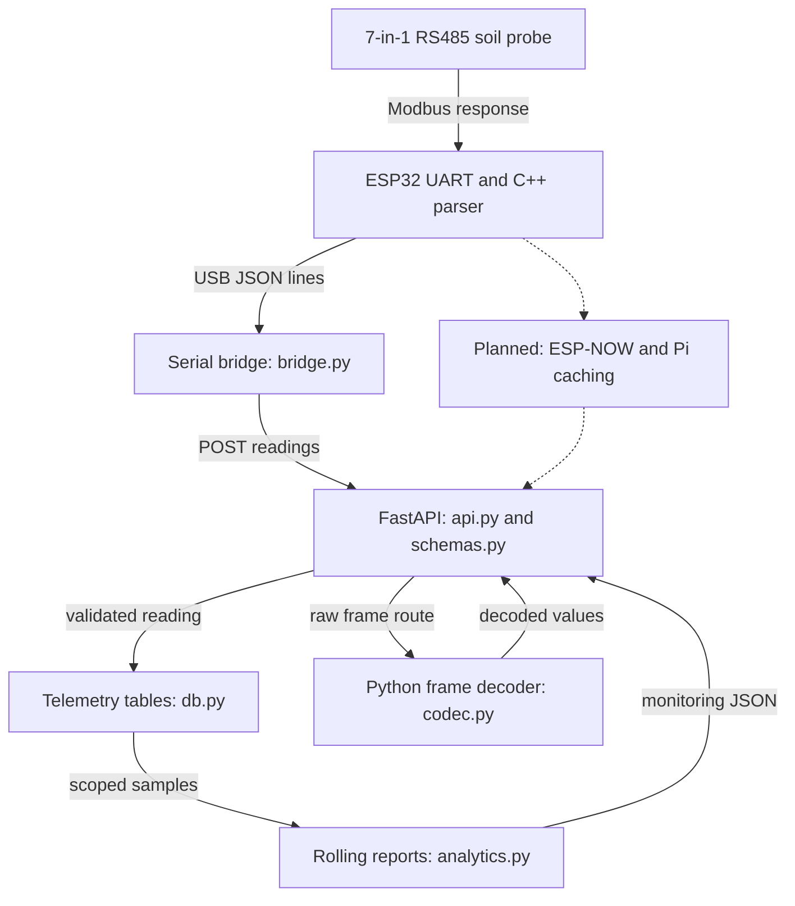

# T-Sensor — Automated Soil Consultant

IoT soil telemetry for continuous root-zone monitoring. ESP32 reference firmware reads a seven-variable Modbus RS485 probe; a Python backend ingests measurements, stores device-scoped history, and calculates rolling monitoring reports.

**Development stage:** Breadboard prototype established, with firmware and backend software implemented in this repository. Draft Flux and STEP exports support the transition toward custom PCB development. Wireless gateway, fabrication, enclosure, and cloud deployment remain subsequent milestones.

**Measurements:** Nitrogen, phosphorus, potassium, moisture, temperature, electrical conductivity, and pH.

## Architecture diagram

Solid arrows trace the implemented reference pipeline. The dashed branch shows the planned ESP-NOW/Raspberry Pi gateway with two caching tiers. Software verification and hardware milestones are listed separately below.



Python modules are under `tsensor/`. The ESP32 node uses `firmware/src/main.cpp` and the portable parser in `firmware/include/soil_protocol.h`. Structured ingestion uses `/readings`; raw Modbus ingestion uses `/frames` and validates framing/CRC before storing a reading.

## Firmware and protocol

The firmware polls `Serial2` at 9600 baud using an eight-byte holding-register request. A response has nineteen bytes: address, function, byte count, seven 16-bit registers, and CRC. The parser checks length, CRC, address, function, and byte count; exception responses and partial frames are rejected.

| Register offset | Reference interpretation |
| --- | --- |
| 0 | Moisture: raw / 10 |
| 1 | Temperature: signed raw / 10 |
| 2 | Electrical conductivity: raw integer |
| 3 | pH: raw / 100 |
| 4–6 | Nitrogen, phosphorus, potassium: raw integers |

Register order, units, signed encoding, and divisors are probe-specific configuration. The exact probe manual is required before applying this reference profile to hardware. Registers are big-endian; the RTU CRC is transmitted low byte first.

Defaults are RX=16, TX=17, address=1, start register=0, and 8N1. `RS485_DE_PIN=-1` assumes automatic direction control. Settings live in `firmware/include/config.h`. The reference sketch polls every five seconds for bench inspection; the intended product interval is 30 minutes.

```bash
cd firmware
pio run
pio run --target upload
pio device monitor
```

## Local API demonstration

Requires Python 3.11+; local verification used Python 3.12.

```bash
python -m venv .venv
source .venv/bin/activate
python -m pip install -e ".[dev]"
uvicorn tsensor.api:app --host 127.0.0.1 --port 8001
# In a second shell with the environment activated:
python -m tsensor.demo
```

The [API explorer](http://127.0.0.1:8001/docs) exposes registration, ingestion, history, and monitoring. The demonstration uses four labeled synthetic readings and SQLite. `sample_data/synthetic_frame.json` provides a constructed CRC-valid response that decodes to moisture 50.0, temperature 25.0, EC 1200, pH 6.5, N 45, P 20, and K 80 under the reference profile.

Register a device before starting the physical serial bridge:

```bash
curl -X POST http://127.0.0.1:8001/organizations \
  -H 'Content-Type: application/json' -d '{"id":"example","name":"Example site"}'
curl -X POST http://127.0.0.1:8001/organizations/example/devices \
  -H 'Content-Type: application/json' -d '{"id":"probe-1"}'
python -m tsensor.bridge --port /dev/ttyUSB0 --org-id example --device-id probe-1
```

The bridge timestamps USB JSON measurements in UTC and performs bounded HTTP retries. An identical device/timestamp is deduplicated; conflicting values return HTTP 409. The current bridge does not provide a durable offline queue.

## Storage and analytics

The schema contains organizations, devices, and readings. Composite foreign keys preserve organization/device scope. A unique `(org_id, device_id, observed_at)` key prevents duplicate samples and supports scoped time queries. Measurements retain source labels and optional raw frames.

Monitoring returns latest values, hourly means, nutrient changes, and exploratory warm/wet and dilution flags. Queries are bounded to 2,000 recent samples and report when that limit is reached. Thresholds require field calibration; flags support inspection rather than diagnosis, prescriptions, or validated nutrient assays.

```bash
export POSTGRES_PASSWORD="$(python -c 'import secrets; print(secrets.token_hex(16))')"
export API_TOKEN="$(python -c 'import secrets; print(secrets.token_hex(16))')"
docker compose up --build
```

Compose binds the API to localhost and requires `X-API-Key`. PostgreSQL's port is not exposed. The shared token is a local access gate; device provisioning and user authorization remain deployment milestones.

## Hardware and design assets

The breadboard configuration uses an ESP32, seven-in-one probe, TTL-to-RS485 converter, MB102 supply, and MT3608 boost converter. Project bench records report a 4.99 V supply, 4.88 V transceiver output, and approximately 3.35 V at RX2 after a 1 kΩ / 2.2 kΩ divider.

- [Flux design project](hardware/dank131-t-sensor.flx): draft circuit and layout export.
- [STEP assembly](hardware/t-sensor.step): electronic assembly export for mechanical integration.
- [Prototype and design notes](hardware/prototype-notes.md): bench configuration, enclosure direction, and manufacturing milestones.

These exports document design progress. Routing, fabrication checks, charging/battery validation, and weatherproofing remain pending. The STEP export is an electronic assembly, not a finished enclosure.

## Verification

**27 tests passed**, including compilation and execution of the portable C++ protocol code with `g++`. Ruff lint and format checks passed.

```bash
pytest -q
ruff check tsensor tests
ruff format --check tsensor tests
```

Tests cover CRC vectors, scaling, signed temperatures, malformed/exception frames, validation, composite keys, duplicates, query scoping, monitoring, and bridge retries. API tests use SQLite and fake HTTP transport. PostgreSQL DDL compilation and Compose YAML parsing passed. [Verification record](docs/verification.json).

The ESP32 build/upload, this firmware's physical UART path, live PostgreSQL, Docker startup, and field calibration remain verification milestones. Host C++ tests validate the shared parser. Recorded prototype hardware work is separate from those software checks.

## Code map

| Location | Responsibility |
| --- | --- |
| `firmware/` | UART polling, C++ protocol parser, and settings |
| `tsensor/codec.py` | Python Modbus validation and decoding |
| `tsensor/api.py`, `tsensor/schemas.py` | Registration, ingestion, and input constraints |
| `tsensor/db.py` | Relationships, timestamp uniqueness, and indexed storage |
| `tsensor/bridge.py` | USB forwarding and bounded retry |
| `tsensor/analytics.py` | Rolling reports and inspection rules |
| `sql/reports.sql` | PostgreSQL telemetry queries |
| `tests/` | Protocol, API, analytics, and bridge checks |
